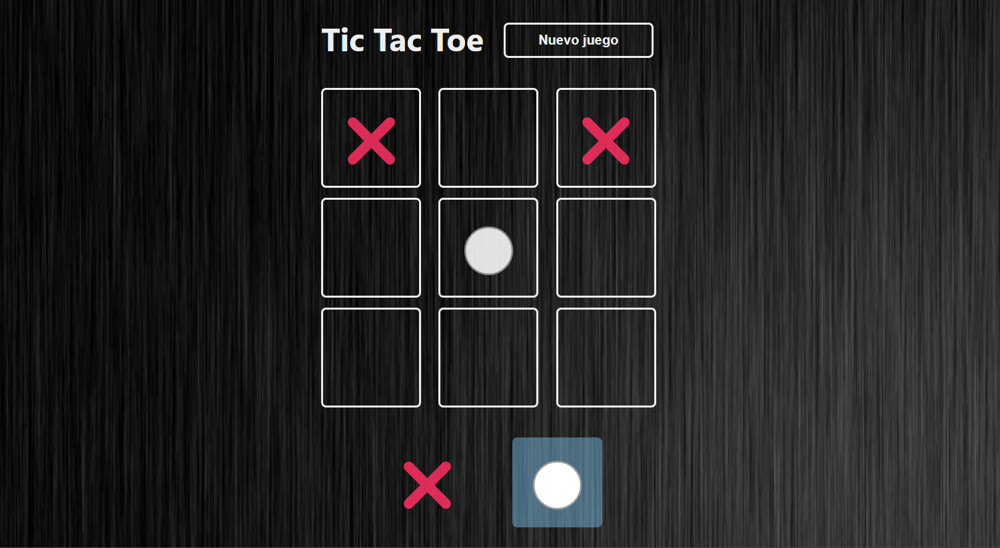

# Tic Tac Toe

**Tic Tac Toe** es una aplicación interactiva desarrollada en **React** como parte del curso _"Aprendiendo React"_ de **Midudev**. Esta aplicación recrea el clásico juego del gato (tres en raya) con una interfaz sencilla pero ideal para practicar conceptos fundamentales de React.

---

## Tecnologías utilizadas

- **React**
- **Vite**
- **Canvas Confetti**
- **ESLint**

---

## Instalación y ejecución

1. Clona este repositorio en tu máquina local `git clone https://github.com/fhidalgorosabal/tic-tac-toe.git`.
2. Accede a la carpeta del proyecto `cd calculator`.
3. Ejecuta `npm install` para instalar los paquetes de node.
4. Para iniciar la aplicación `npm run dev` y accede en el navedador a `http://localhost:5173/`.
   
---   

## Aplicación

---

## Autor

Desarrollado por: Fernando Hidalgo Rosabal.

---

## Licencia

Este proyecto está licenciado bajo la [Licencia MIT](https://opensource.org/licenses/MIT).

---